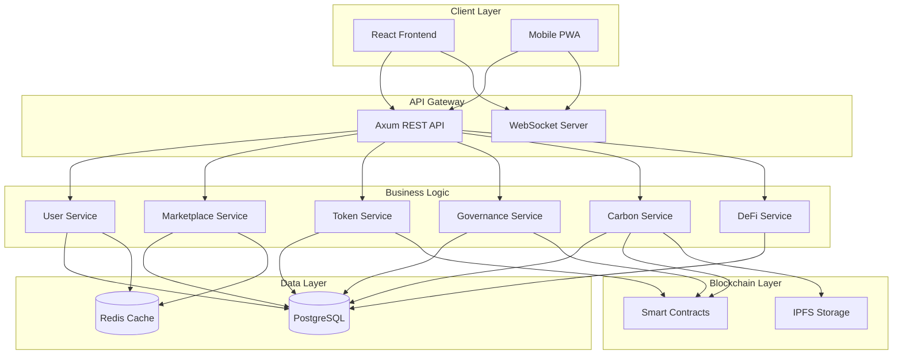
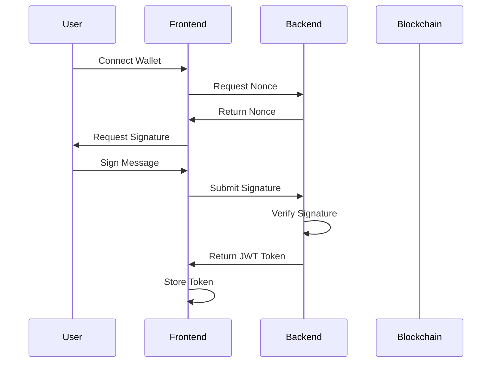

# DOFTA Production-Ready Architecture Plan

## Executive Summary

This document outlines the comprehensive plan to transform the DOFTA (Digital Farmer's Co-operative) dApp from an AI-generated prototype into a production-ready application using **Rust** for the backend and **React** for the frontend.

---

## Current State Analysis

### Critical Issues Identified

#### 1. **Architecture Problems**
- ❌ No backend - all data is mocked in frontend
- ❌ No API layer or data persistence
- ❌ No authentication or authorization system
- ❌ No state management (using only local React state)
- ❌ No routing library (manual screen switching)
- ❌ No error handling or validation
- ❌ No environment configuration
- ❌ No testing infrastructure

#### 2. **Frontend Issues**
- ❌ Inline Tailwind classes everywhere (no design system)
- ❌ Mock data hardcoded in components
- ❌ No proper component organization
- ❌ No TypeScript strict mode
- ❌ No form validation
- ❌ No loading states or error boundaries
- ❌ No accessibility considerations
- ❌ Inconsistent mobile/desktop handling

#### 3. **Business Logic Issues**
- ❌ No blockchain integration (despite being a dApp)
- ❌ No real token economics implementation
- ❌ No smart contract interaction
- ❌ No wallet connection (MetaMask, WalletConnect)
- ❌ No real-time data updates
- ❌ No data validation or sanitization

#### 4. **Security Concerns**
- ❌ No authentication mechanism
- ❌ No authorization checks
- ❌ No input validation
- ❌ No rate limiting
- ❌ No CORS configuration
- ❌ No secure session management

---

## Production Architecture Design

### Technology Stack

#### Backend (Rust)
```
- Framework: Axum (modern, fast, type-safe)
- Database: PostgreSQL with SQLx
- Caching: Redis
- Authentication: JWT + OAuth2
- WebSocket: Tokio-tungstenite
- Blockchain: ethers-rs / web3
- Testing: cargo test + integration tests
```

#### Frontend (React)
```
- Framework: React 18+ with TypeScript
- Routing: React Router v6
- State Management: Zustand + React Query
- UI Library: Radix UI + Tailwind CSS
- Forms: React Hook Form + Zod
- Blockchain: wagmi + viem
- Testing: Vitest + React Testing Library
- Build: Vite
```

#### Infrastructure
```
- Containerization: Docker + Docker Compose
- CI/CD: GitHub Actions
- Monitoring: Prometheus + Grafana
- Logging: Structured logging (tracing)
- Deployment: Kubernetes / Cloud Run
```

---

## System Architecture



---

## Database Schema Design

### Core Tables

#### users
```sql
CREATE TABLE users (
    id UUID PRIMARY KEY DEFAULT gen_random_uuid(),
    wallet_address VARCHAR(42) UNIQUE NOT NULL,
    email VARCHAR(255) UNIQUE,
    role VARCHAR(20) NOT NULL CHECK (role IN ('FARMER', 'BUYER', 'ADMIN')),
    profile_data JSONB,
    kyc_status VARCHAR(20) DEFAULT 'PENDING',
    created_at TIMESTAMPTZ DEFAULT NOW(),
    updated_at TIMESTAMPTZ DEFAULT NOW()
);
```

#### farms
```sql
CREATE TABLE farms (
    id UUID PRIMARY KEY DEFAULT gen_random_uuid(),
    farmer_id UUID REFERENCES users(id) ON DELETE CASCADE,
    name VARCHAR(255) NOT NULL,
    location GEOGRAPHY(POINT),
    size_hectares DECIMAL(10,2),
    certifications JSONB,
    created_at TIMESTAMPTZ DEFAULT NOW(),
    updated_at TIMESTAMPTZ DEFAULT NOW()
);
```

#### marketplace_listings
```sql
CREATE TABLE marketplace_listings (
    id UUID PRIMARY KEY DEFAULT gen_random_uuid(),
    farmer_id UUID REFERENCES users(id) ON DELETE CASCADE,
    product_name VARCHAR(255) NOT NULL,
    quantity DECIMAL(10,2) NOT NULL,
    unit VARCHAR(50) NOT NULL,
    price_per_unit DECIMAL(10,2) NOT NULL,
    quality_score INTEGER CHECK (quality_score >= 0 AND quality_score <= 100),
    sustainability_badges JSONB,
    status VARCHAR(20) DEFAULT 'ACTIVE',
    created_at TIMESTAMPTZ DEFAULT NOW(),
    updated_at TIMESTAMPTZ DEFAULT NOW()
);
```

#### transactions
```sql
CREATE TABLE transactions (
    id UUID PRIMARY KEY DEFAULT gen_random_uuid(),
    user_id UUID REFERENCES users(id) ON DELETE CASCADE,
    transaction_type VARCHAR(50) NOT NULL,
    token_type VARCHAR(20) NOT NULL,
    amount DECIMAL(18,8) NOT NULL,
    tx_hash VARCHAR(66),
    status VARCHAR(20) DEFAULT 'PENDING',
    metadata JSONB,
    created_at TIMESTAMPTZ DEFAULT NOW()
);
```

#### governance_proposals
```sql
CREATE TABLE governance_proposals (
    id UUID PRIMARY KEY DEFAULT gen_random_uuid(),
    proposer_id UUID REFERENCES users(id) ON DELETE CASCADE,
    title VARCHAR(255) NOT NULL,
    description TEXT NOT NULL,
    proposal_type VARCHAR(50) NOT NULL,
    status VARCHAR(20) DEFAULT 'ACTIVE',
    votes_for BIGINT DEFAULT 0,
    votes_against BIGINT DEFAULT 0,
    start_date TIMESTAMPTZ DEFAULT NOW(),
    end_date TIMESTAMPTZ NOT NULL,
    created_at TIMESTAMPTZ DEFAULT NOW()
);
```

#### carbon_credits
```sql
CREATE TABLE carbon_credits (
    id UUID PRIMARY KEY DEFAULT gen_random_uuid(),
    farm_id UUID REFERENCES farms(id) ON DELETE CASCADE,
    amount_tco2e DECIMAL(10,4) NOT NULL,
    verification_data JSONB NOT NULL,
    nft_token_id VARCHAR(255),
    ipfs_hash VARCHAR(255),
    status VARCHAR(20) DEFAULT 'PENDING',
    minted_at TIMESTAMPTZ,
    created_at TIMESTAMPTZ DEFAULT NOW()
);
```

---

## API Endpoints Design

### Authentication
```
POST   /api/v1/auth/connect-wallet
POST   /api/v1/auth/verify-signature
POST   /api/v1/auth/refresh-token
POST   /api/v1/auth/logout
```

### Users
```
GET    /api/v1/users/me
PUT    /api/v1/users/me
GET    /api/v1/users/:id
POST   /api/v1/users/kyc
```

### Marketplace
```
GET    /api/v1/marketplace/listings
GET    /api/v1/marketplace/listings/:id
POST   /api/v1/marketplace/listings
PUT    /api/v1/marketplace/listings/:id
DELETE /api/v1/marketplace/listings/:id
POST   /api/v1/marketplace/orders
GET    /api/v1/marketplace/orders
```

### Tokens & Wallet
```
GET    /api/v1/wallet/balances
GET    /api/v1/wallet/transactions
POST   /api/v1/tokens/transfer
POST   /api/v1/tokens/mint
```

### Governance
```
GET    /api/v1/governance/proposals
GET    /api/v1/governance/proposals/:id
POST   /api/v1/governance/proposals
POST   /api/v1/governance/proposals/:id/vote
```

### Carbon Credits
```
POST   /api/v1/carbon/verify
POST   /api/v1/carbon/mint
GET    /api/v1/carbon/credits
GET    /api/v1/carbon/credits/:id
```

### DeFi
```
GET    /api/v1/defi/credit-score
POST   /api/v1/defi/loan-application
GET    /api/v1/defi/loans
```

### WebSocket
```
WS     /ws/notifications
WS     /ws/marketplace-updates
WS     /ws/governance-updates
```

---

## Frontend Architecture

### Directory Structure
```
frontend/
├── src/
│   ├── app/                    # App configuration
│   │   ├── App.tsx
│   │   ├── router.tsx
│   │   └── providers.tsx
│   ├── features/               # Feature-based modules
│   │   ├── auth/
│   │   │   ├── components/
│   │   │   ├── hooks/
│   │   │   ├── services/
│   │   │   └── types.ts
│   │   ├── marketplace/
│   │   ├── governance/
│   │   ├── carbon/
│   │   ├── defi/
│   │   └── wallet/
│   ├── shared/                 # Shared resources
│   │   ├── components/         # Reusable UI components
│   │   ├── hooks/              # Custom hooks
│   │   ├── utils/              # Utility functions
│   │   ├── types/              # Shared types
│   │   └── constants/          # Constants
│   ├── lib/                    # Third-party integrations
│   │   ├── api/                # API client
│   │   ├── blockchain/         # Web3 integration
│   │   └── websocket/          # WebSocket client
│   ├── stores/                 # State management
│   │   ├── authStore.ts
│   │   ├── walletStore.ts
│   │   └── uiStore.ts
│   └── styles/                 # Global styles
│       ├── globals.css
│       └── theme.ts
├── public/
├── tests/
└── package.json
```

### State Management Strategy
```typescript
// Zustand for client state
- authStore: user session, wallet connection
- uiStore: theme, modals, notifications
- walletStore: token balances, transactions

// React Query for server state
- useMarketplaceListings()
- useGovernanceProposals()
- useUserProfile()
- useCarbonCredits()
```

---

## Backend Architecture

### Directory Structure
```
backend/
├── src/
│   ├── main.rs                 # Application entry point
│   ├── config/                 # Configuration
│   │   ├── mod.rs
│   │   ├── database.rs
│   │   └── settings.rs
│   ├── api/                    # API layer
│   │   ├── mod.rs
│   │   ├── routes/
│   │   ├── handlers/
│   │   └── middleware/
│   ├── services/               # Business logic
│   │   ├── mod.rs
│   │   ├── user_service.rs
│   │   ├── marketplace_service.rs
│   │   ├── token_service.rs
│   │   ├── governance_service.rs
│   │   └── carbon_service.rs
│   ├── models/                 # Data models
│   │   ├── mod.rs
│   │   ├── user.rs
│   │   ├── listing.rs
│   │   └── transaction.rs
│   ├── db/                     # Database layer
│   │   ├── mod.rs
│   │   ├── migrations/
│   │   └── repositories/
│   ├── blockchain/             # Blockchain integration
│   │   ├── mod.rs
│   │   ├── contracts.rs
│   │   └── events.rs
│   ├── utils/                  # Utilities
│   │   ├── mod.rs
│   │   ├── auth.rs
│   │   ├── validation.rs
│   │   └── errors.rs
│   └── tests/                  # Integration tests
├── migrations/                 # SQL migrations
├── Cargo.toml
└── Dockerfile
```

### Key Rust Dependencies
```toml
[dependencies]
axum = "0.7"
tokio = { version = "1", features = ["full"] }
sqlx = { version = "0.7", features = ["postgres", "runtime-tokio-native-tls", "uuid", "chrono"] }
serde = { version = "1.0", features = ["derive"] }
serde_json = "1.0"
jsonwebtoken = "9"
bcrypt = "0.15"
uuid = { version = "1.0", features = ["v4", "serde"] }
chrono = { version = "0.4", features = ["serde"] }
tracing = "0.1"
tracing-subscriber = "0.3"
tower = "0.4"
tower-http = { version = "0.5", features = ["cors", "trace"] }
redis = { version = "0.24", features = ["tokio-comp"] }
ethers = "2.0"
```

---

## Smart Contract Architecture

### Token Contracts

#### WASTE Token (ERC-20)
```solidity
// Reward token for waste prevention
- Mintable by verified actions
- Burnable for marketplace fees
- Stakeable for governance
```

#### CARBO NFT (ERC-721)
```solidity
// Carbon credit certificates
- Metadata stored on IPFS
- Verifiable on-chain
- Tradeable on secondary markets
```

#### DOFTA Token (ERC-20)
```solidity
// Governance token
- Voting power
- Staking rewards
- Platform revenue sharing
```

### Core Contracts

#### Marketplace Contract
```solidity
- Escrow functionality
- Automated payments
- Dispute resolution
- Quality verification
```

#### Governance Contract
```solidity
- Proposal creation
- Voting mechanism
- Timelock execution
- Treasury management
```

---

## Security Implementation

### Authentication Flow


### Security Measures
1. **Authentication**
   - Wallet-based authentication (Web3)
   - JWT tokens with refresh mechanism
   - Rate limiting on auth endpoints

2. **Authorization**
   - Role-based access control (RBAC)
   - Resource-level permissions
   - API key management for services

3. **Data Protection**
   - Input validation and sanitization
   - SQL injection prevention (parameterized queries)
   - XSS protection
   - CSRF tokens for state-changing operations

4. **Infrastructure**
   - HTTPS only
   - CORS configuration
   - Security headers
   - DDoS protection
   - Regular security audits

---

## Testing Strategy

### Backend Testing
```rust
// Unit tests
#[cfg(test)]
mod tests {
    // Test individual functions
}

// Integration tests
#[tokio::test]
async fn test_create_listing() {
    // Test API endpoints
}

// Load tests
// Use criterion for benchmarking
```

### Frontend Testing
```typescript
// Unit tests (Vitest)
describe('Button', () => {
  it('renders correctly', () => {
    // Test component
  });
});

// Integration tests (React Testing Library)
test('user can create listing', async () => {
  // Test user flows
});

// E2E tests (Playwright)
test('complete marketplace flow', async ({ page }) => {
  // Test full user journey
});
```

### Smart Contract Testing
```javascript
// Hardhat tests
describe("Marketplace", function () {
  it("Should create listing", async function () {
    // Test contract functions
  });
});
```

---

## Deployment Strategy

### Development Environment
```yaml
# docker-compose.dev.yml
services:
  postgres:
    image: postgres:16
  redis:
    image: redis:7
  backend:
    build: ./backend
    environment:
      - DATABASE_URL=postgres://...
      - REDIS_URL=redis://...
  frontend:
    build: ./frontend
    environment:
      - VITE_API_URL=http://localhost:8000
```

### Production Deployment
```yaml
# Kubernetes deployment
- Frontend: Cloud CDN + Static hosting
- Backend: Kubernetes cluster (3+ replicas)
- Database: Managed PostgreSQL (with replicas)
- Redis: Managed Redis cluster
- Monitoring: Prometheus + Grafana
- Logging: ELK Stack
```

### CI/CD Pipeline
```yaml
# .github/workflows/deploy.yml
name: Deploy
on:
  push:
    branches: [main]
jobs:
  test:
    - Run tests
    - Run linters
    - Security scan
  build:
    - Build Docker images
    - Push to registry
  deploy:
    - Deploy to staging
    - Run smoke tests
    - Deploy to production
```

---

## Performance Optimization

### Backend
- Connection pooling (SQLx)
- Redis caching for hot data
- Database indexing strategy
- Query optimization
- Async/await throughout
- Load balancing

### Frontend
- Code splitting
- Lazy loading routes
- Image optimization
- Bundle size optimization
- Service worker for PWA
- Memoization strategies

### Database
- Proper indexing
- Query optimization
- Connection pooling
- Read replicas
- Partitioning for large tables

---

## Monitoring & Observability

### Metrics to Track
```
Backend:
- Request latency (p50, p95, p99)
- Error rates
- Database query performance
- Cache hit rates
- Active connections

Frontend:
- Page load time
- Time to interactive
- Core Web Vitals
- Error tracking
- User engagement

Blockchain:
- Transaction success rate
- Gas costs
- Contract interactions
- Event processing lag
```

### Logging Strategy
```rust
// Structured logging with tracing
tracing::info!(
    user_id = %user.id,
    action = "create_listing",
    "User created marketplace listing"
);
```

---

## Migration Plan

### Phase 1: Foundation (Weeks 1-2)
- Set up project structure
- Configure development environment
- Create database schema
- Set up CI/CD pipeline

### Phase 2: Backend Core (Weeks 3-4)
- Implement authentication
- Build user service
- Create marketplace API
- Set up WebSocket server

### Phase 3: Frontend Core (Weeks 5-6)
- Set up React architecture
- Implement authentication flow
- Build marketplace UI
- Add wallet integration

### Phase 4: Advanced Features (Weeks 7-8)
- Governance system
- Carbon credit minting
- DeFi portal
- Real-time notifications

### Phase 5: Testing & Polish (Weeks 9-10)
- Comprehensive testing
- Performance optimization
- Security audit
- Documentation

### Phase 6: Deployment (Week 11)
- Staging deployment
- Load testing
- Production deployment
- Monitoring setup

---

## Success Metrics

### Technical Metrics
- API response time < 200ms (p95)
- Frontend load time < 2s
- 99.9% uptime
- Zero critical security vulnerabilities
- Test coverage > 80%

### Business Metrics
- User registration rate
- Transaction volume
- Marketplace liquidity
- Governance participation
- Carbon credits minted

---

## Risk Mitigation

### Technical Risks
1. **Blockchain Integration Complexity**
   - Mitigation: Use battle-tested libraries (ethers-rs, wagmi)
   - Fallback: Implement retry mechanisms

2. **Scalability Concerns**
   - Mitigation: Horizontal scaling, caching, CDN
   - Monitoring: Set up alerts for performance degradation

3. **Data Consistency**
   - Mitigation: Database transactions, event sourcing
   - Testing: Comprehensive integration tests

### Business Risks
1. **Regulatory Compliance**
   - Mitigation: KYC/AML implementation
   - Legal review of token economics

2. **User Adoption**
   - Mitigation: Intuitive UX, comprehensive onboarding
   - Analytics: Track user behavior and pain points

---

## Next Steps

1. **Review and approve this plan**
2. **Set up development environment**
3. **Create detailed task breakdown**
4. **Begin Phase 1 implementation**
5. **Establish regular progress reviews**

---

## Conclusion

This plan transforms the DOFTA prototype into a production-ready, scalable, and secure dApp. The architecture leverages Rust's performance and safety for the backend, React's ecosystem for the frontend, and follows industry best practices throughout.

The modular design allows for iterative development while maintaining code quality and system reliability. With proper execution, this will result in a professional-grade agricultural cooperative platform.